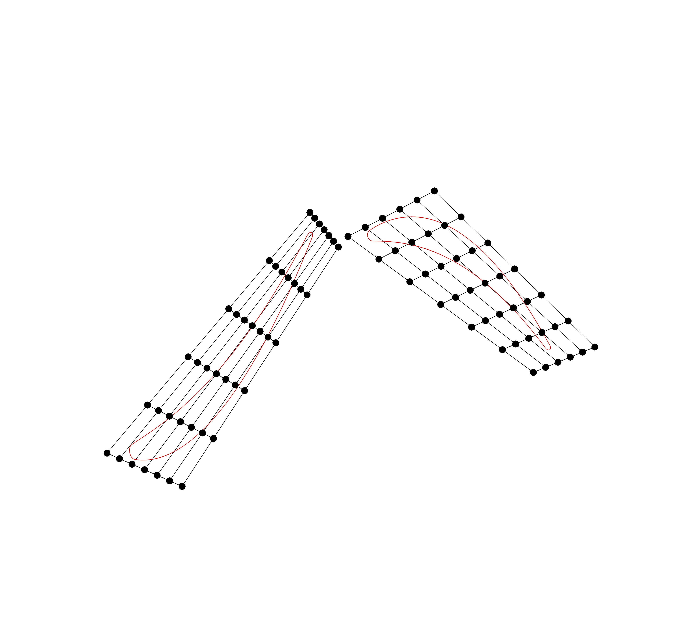
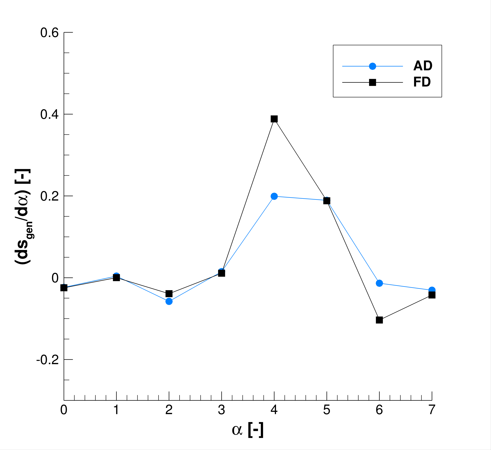

# Steady 2D Multizone Axial Turbine
This folder contains an optimization test case representing a two-dimensional stator-rotor domain of an axial turbomachine.
For the harmonic balance unsteady version of this same test case, please refer [here](../US_HB).
 
The case itself is identical to the simulation case found [here](../../simulation/ST_MP). More info on flow simulation runs can be found there.

### Setup

The shape parameterization method used is Free Form Deformation. The FFD boxes are shown in the figure below.

 

### Run
This shape optimization was only performed and checked functional in the `feature_turbo_ffd` branch of `SU2`.
As discussed in much more detail in the Bitbucket `SU2` tutorial series, the test case can be run in series using

``shape_optimization.py -f a1_air_steady.cfg -n <number of cores> -g <gradient> -z <number of zones>``

Both the config and mesh files are present in this folder.

### Gradient Validation

The adjoint gradients have been validated by comparing them to those obtained using a finite difference method. The results are shown in the figures below.

 
 

