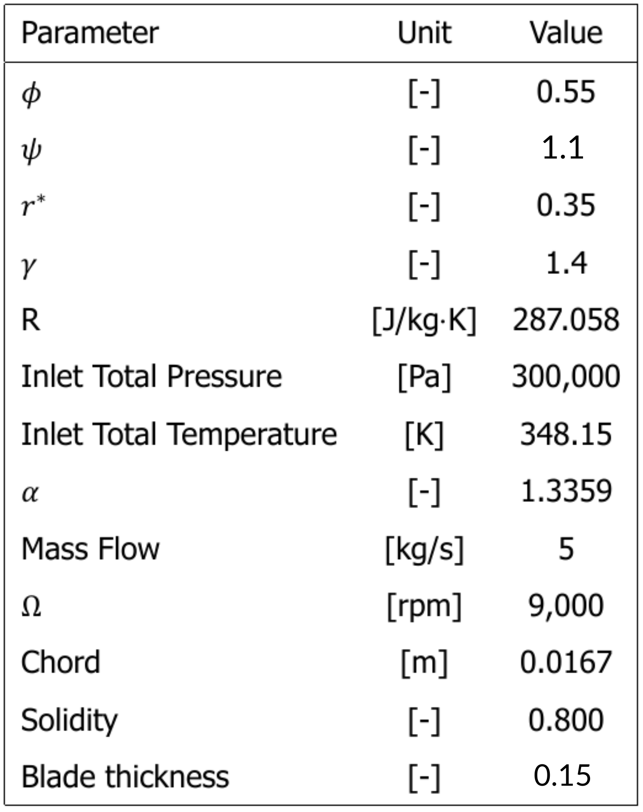
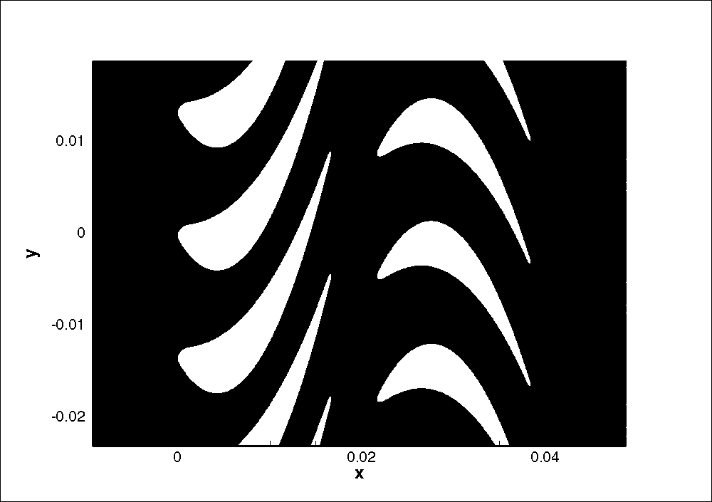
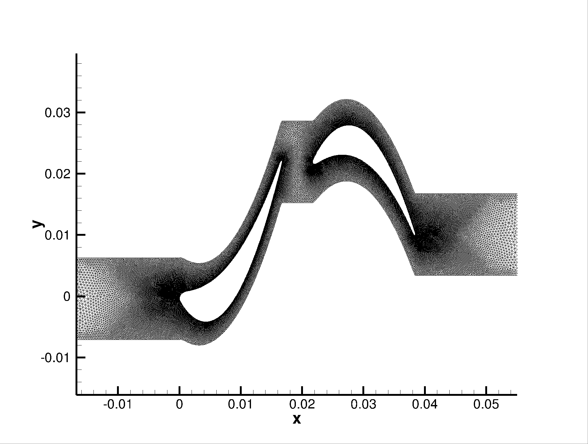
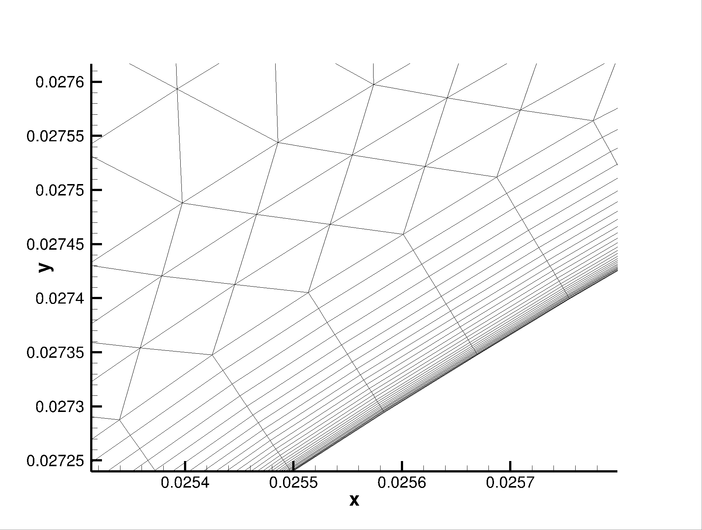
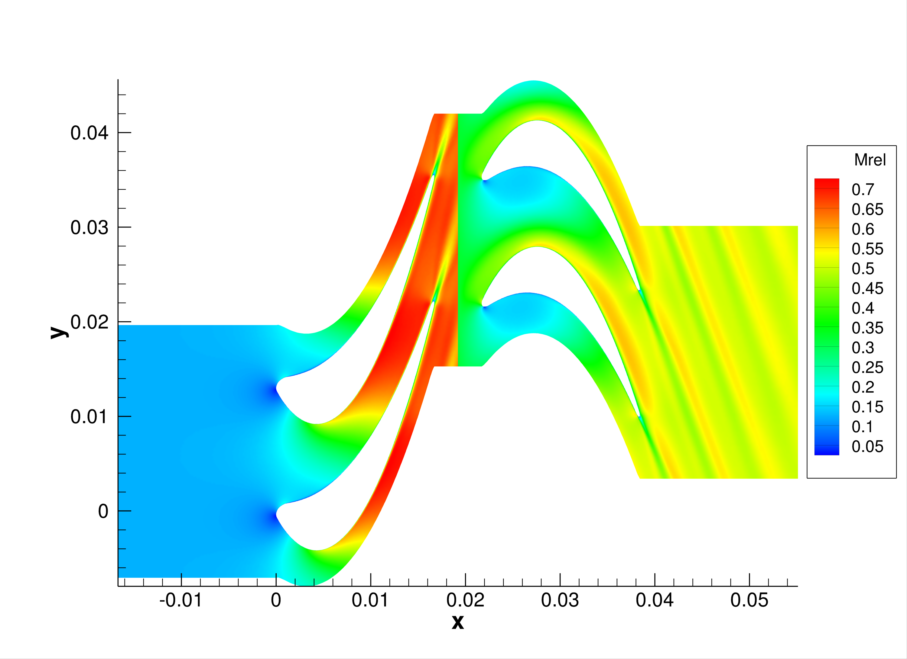

# Steady 2D Multizone Axial Turbine
This folder contains a test case representing a two-dimensional stator-rotor domain of an axial turbomachine. The stage was created as part of a master thesis at the turbomachinery department. It shares and bases some of its main characteristics on the Aachen 1.5 stage reference turbomachine, that is represented in another test case in this repository.
For the harmonic balance unsteady version of this same test case, please refer [here](../US_HB_2D_MZ_AXIAL-TURBINE).
 
The stage is characterized by a flow coefficient of 0.55, work coefficient (phi) of 2.2 and degree of reaction of 0.35. A list of the other set of main stage characteristics is shown in the table below. α represents the volumetric flow ratio.

 

The geometry as shown in the figure is a result of several meanline design steps, mainly in the `meangen` and `stagen` tools of the `Multall` software suite.

 

### Mesh
The mesh is created using the in-house `umg2` software. It is made up of 105920 elements, consisting of mostly unstructured grid throughout the flow domain and a structured boundary layer close to the blade surface. The mesh as well as a close-up are illustrated by the figures below. The amount of grid cells and the mesh performance has been verified with a mesh convergence study, also shown below.

 
 
 

### Run
As discussed in much more detail in the [execute](../../../HOW_TO_SU2/3_execute) part of the tutorial series, the test case can be run in series using

``SU2_CFD -f c1_air_steady.cfg``

or in parallel with

``parallel_computation.py -f c1_air_steady.cfg -n <number of cores>``

Both the config and mesh files are present in this folder.

### Results
The figures below visualize the relative Mach and entropy contours that result from the simulation of this test case.

