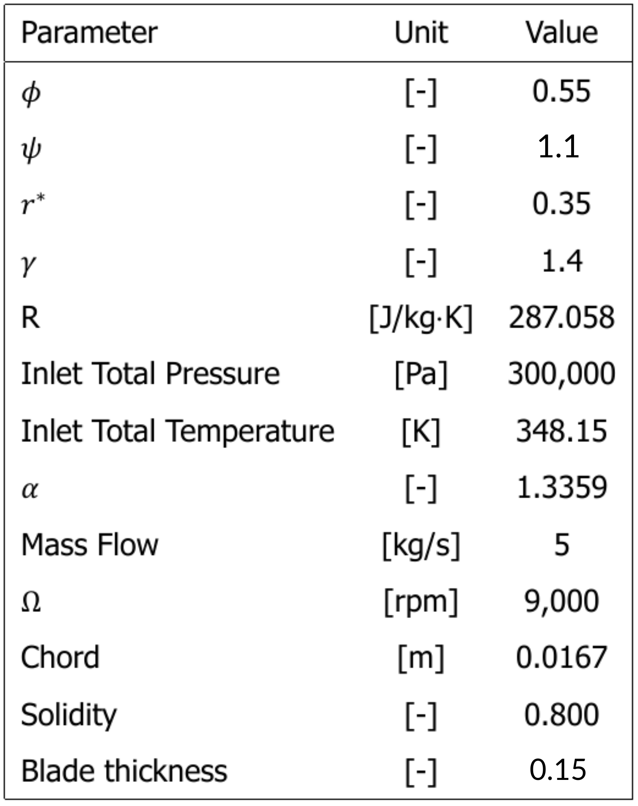
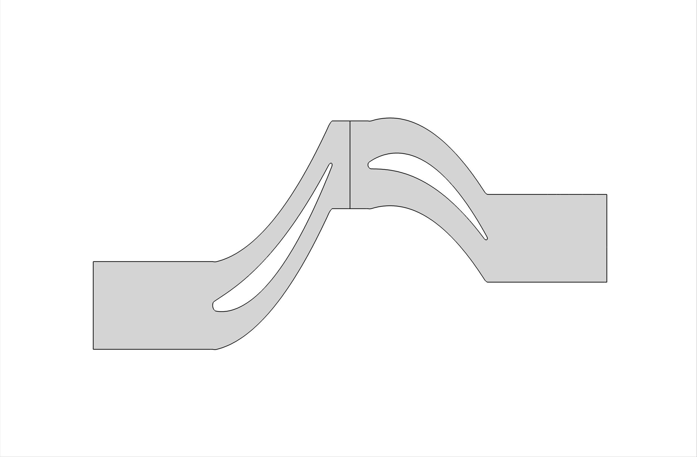
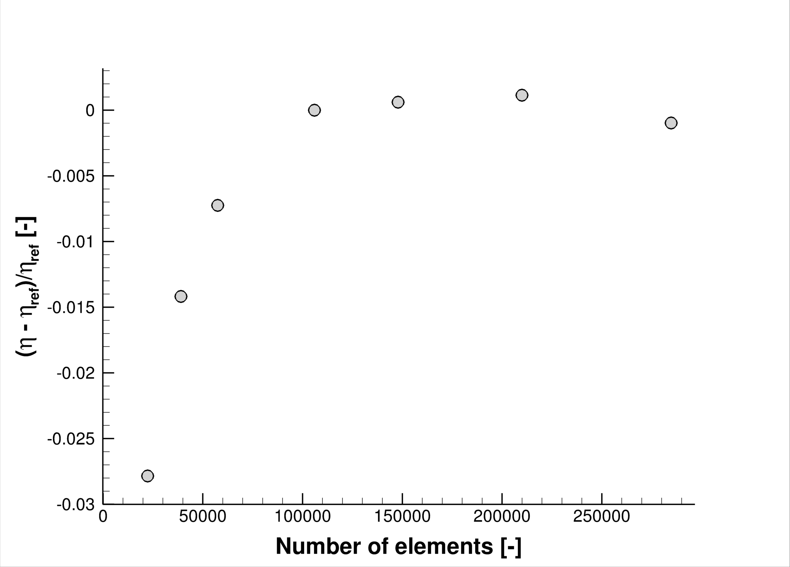
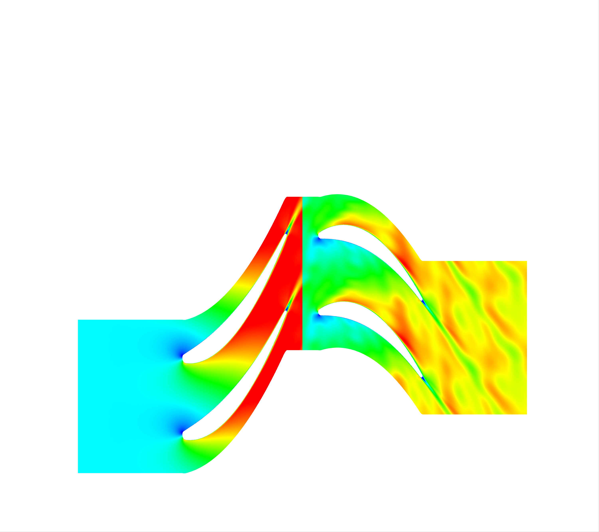
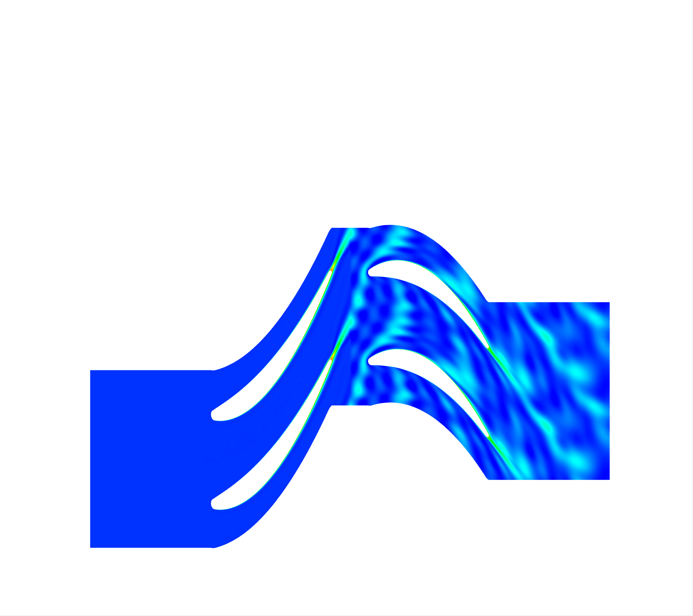

# Unsteady Harmonic Balance 2D Multizone Axial Turbine
This folder contains a test case representing a two-dimensional stator-rotor domain of an axial turbomachine. 
For the steady-state version of this same test case, please refer [here](../ST_MP).
 
The stage is characterized by a flow coefficient of 0.55, work coefficient (psi) of 1.1 and degree of reaction of 0.35. A list of the other set of main stage characteristics is shown in the table below. α represents the volumetric flow ratio.

 

This test case uses five time instances. The number of time instances and the corresponding frequencies and period can be changed under the options `TIME_INSTANCES`, `OMEGA_HB` and `HB_PERIOD` respectively. More time instances will make the simulation slower and more accurate. Feel free to play around with the values. For three time instances, just remove the positive and negative largest frequency. For seven, add triple the positive and negative base frequency.

The geometry as shown in the figure is a result of several meanline design steps, mainly in the `meangen` and `stagen` tools of the `Multall` software suite.

 

### Mesh
The mesh is created using the in-house `umg2` software. More information and input files for the meshing process can be found [here](.../meshing). The mesh consists of a mostly unstructured grid throughout the flow domain and a structured boundary layer close to the blade surface. The amount of grid cells and the mesh performance has been verified with a mesh convergence study in the steady-state solver, shown below.

 

### Run
This simulation was only performed and checked functional in the `feature_TMZHB_temp` branch of `SU2`.
As discussed in much more detail in the Bitbucket `SU2` tutorial series, the test case can be run in series using

``SU2_CFD -f a1_air_HB.cfg``

or in parallel with

``parallel_computation.py -f a1_air_HB.cfg -n <number of cores>``

Both the config and mesh files are present in this folder.

### Results
The figures below visualize the relative Mach and entropy contours that result from the simulation of this test case.

